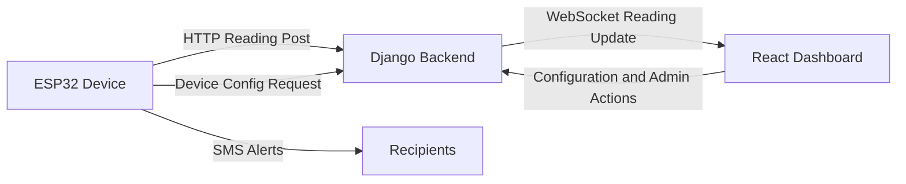
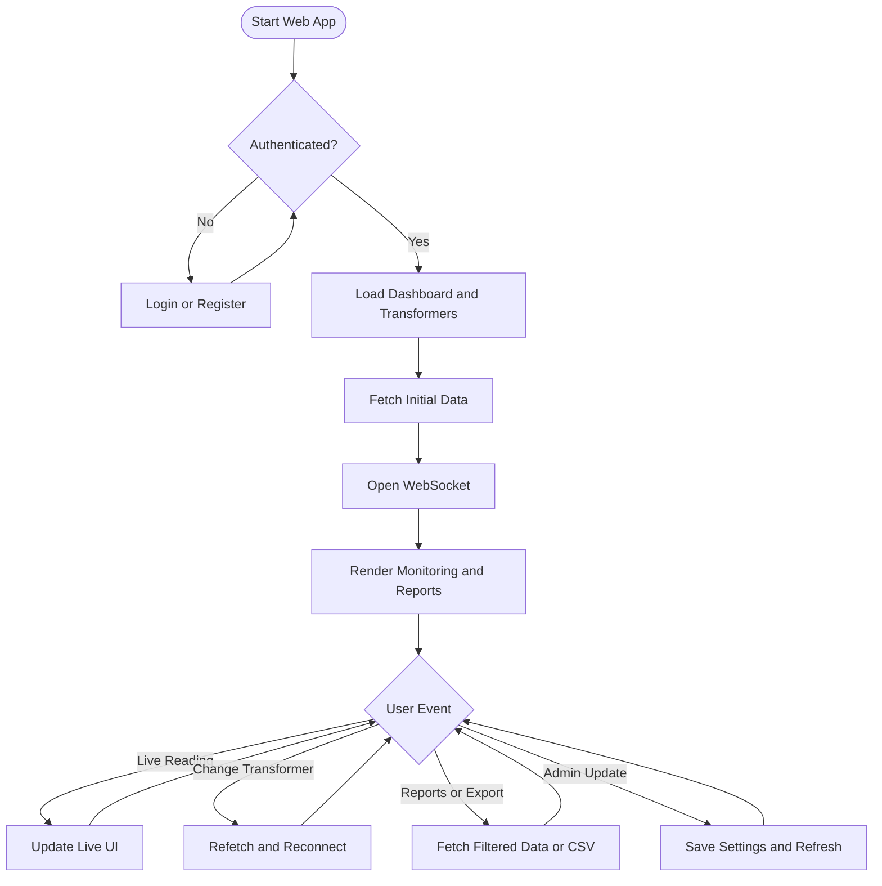
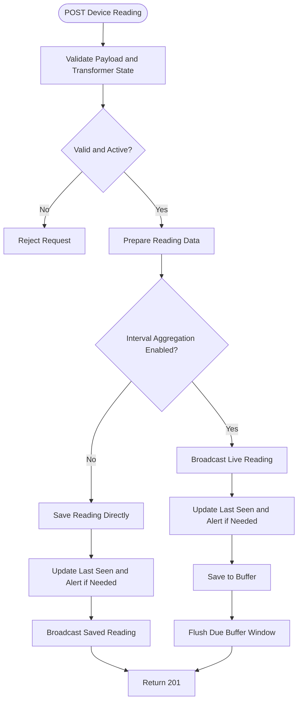
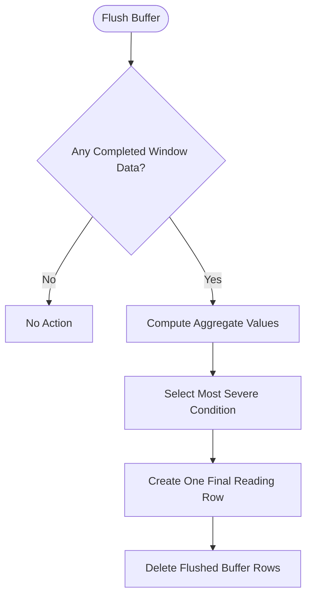
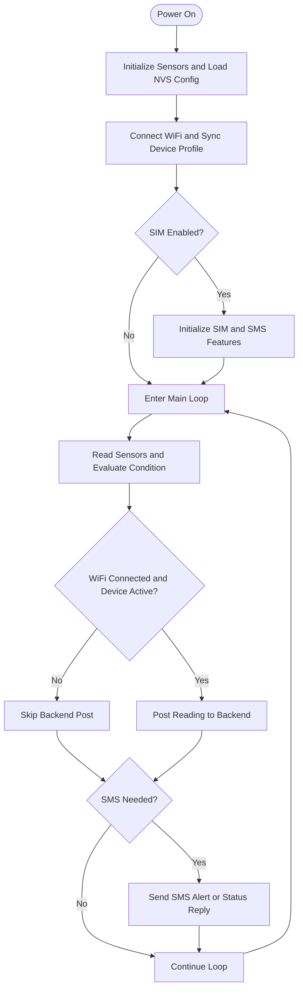
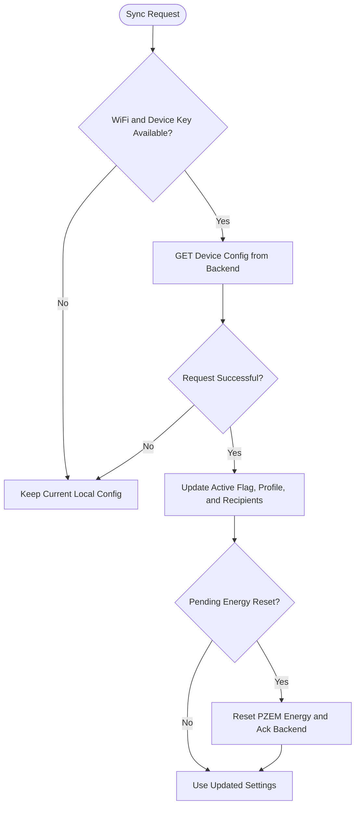
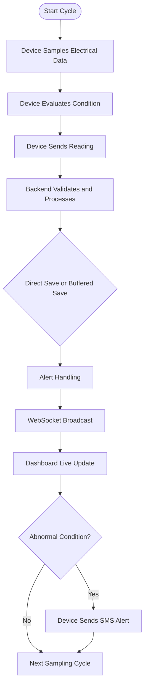

# PoleTransMonitor Mermaid Flowcharts (Thesis Style)

This version simplifies the previous diagrams into higher-level flowcharts with fewer boxes.

Use these when you need clean, presentation-ready visuals for thesis chapters.

---

## 1. System Architecture Flow

---

## 2. Web App Operational Flow

---

## 3. Backend Reading Ingest and Storage Flow

---

## 4. Backend Aggregation Sub-Flow

---

## 5. Device Runtime Flow

---

## 6. Device Configuration Sync Flow

---

## 7. End-to-End Monitoring Cycle

---

## 8. Suggested Thesis Figure Order

Use this order in your manuscript:

1. System Architecture Flow
2. Web App Operational Flow
3. Backend Reading Ingest and Storage Flow
4. Backend Aggregation Sub-Flow
5. Device Runtime Flow
6. End-to-End Monitoring Cycle
